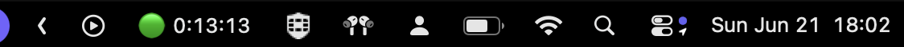

# work-timer

Aplikacja menu bar dla macOS, która liczy czas pracy programisty.



- Liczy czas, gdy jesteś aktywny (klawiatura/mysz).
- Liczy dalej, gdy Claude Code (CLI) pracuje, nawet gdy odejdziesz od komputera.
- Po przekroczeniu progu bezczynności (domyślnie 120 s) wstrzymuje się i cofa naliczoną karencję.
- Reset licznika codziennie o 17:00.

## Budowanie

```bash
./build-app.sh
open WorkTimer.app
```
